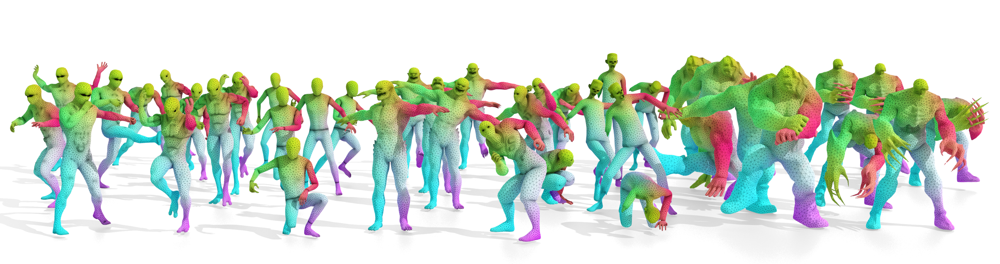

# DeformingThings4D-Matching Dataset
 
<p>

</p>

This is a new dataset adapted from [DeformThings4D](https://github.com/rabbityl/DeformingThings4D) for *non-isometric shape matching task* as introduced in our paper "Smooth Non-Rigid Shape Matching via Effective Dirichlet Energy Optimization",
by [Robin Magnet](http://www.lix.polytechnique.fr/Labo/Robin.Magnet/), [Jing Ren](https://ren-jing.com/), [Olga Sorkine-Hornung](https://igl.ethz.ch/people/sorkine/)
and [Maks Ovsjanikov](http://www.lix.polytechnique.fr/~maks/).

You can find more details at: [paper]() | [code](https://github.com/RobinMagnet/smoothFM) | [supplementary]()

## Dataset Details
- We select **8 humanoid categories** from the original DeformThings4D dataset, including *Crypto, Zlorp, Mannequin,  Drake, Ninja, Prisoner, Pumpkinhulk, Skeletonzombie*, as shown in the teaser figure from left to right respectively. 
- We also provide *Ortiz* and *Mousey* in this repository with inter-category correpondences, but the cross-category correspondences are hard to obtain for these two models
- Each model has 15-30 different shapes in different poses that are remeshed independently with inter-category correspondences. 
- See ```demo1_visualize_cross_category_map``` for an example of loading the **cross-category** correspondences
- See ```demo2_visualize_inter_category_map``` for an example of loading the **inter-category** correspondences


## Construction Details
- We first find the humanoid models in DeformingThings4D dataset wholse largest connected component contains more than 75% vertices (so we do not lose too many details once we only keep the largest connected component, which is easier than stiching disconnected components to get a watertight shape)
- For each model, we select poses from provided animations that have large enough variations and save them as ```Xk.obj```, i.e., the k-th frame of the X animation.
- For each pose we apply LRVD algorithm to remesh it independently (with around 8K vertices) and track the inter-category correspondences
- We then use [Wrap3D](https://www.russian3dscanner.com/), a commercial software, to wrap different models to the *Crypto* model, from which we can extract the cross-category correspondences.

Please see our paper for more details.

## Citation
If this dataset is used in your work, please do not forget to cite the original *DeformThings4D* paper, and *LRVD* method (we used for remeshing), besides our paper:

```
@article{li20214dcomplete, 
    title={4dcomplete: Non-rigid motion estimation beyond the observable surface.}, 
    author={Yang Li, Hikari Takehara, Takafumi Taketomi, Bo Zheng, and Matthias Nießner},
    journal={IEEE International Conference on Computer Vision (ICCV)},
    year={2021}
}

@article{yan2014low,
  title={Low-resolution remeshing using the localized restricted Voronoi diagram},
  author={Yan, Dong-Ming and Bao, Guanbo and Zhang, Xiaopeng and Wonka, Peter},
  journal={IEEE Transactions on Visualization and Computer Graphics (TVCG)},
  year={2014}
}

@inproceedings{magnet2022smooth,
  title={Smooth Non-Rigid Shape Matching via Effective Dirichlet Energy Optimization},
  author={Magnet, Robin and Ren, Jing and Sorkine-Hornung, Olga and Ovsjanikov, Maks},
  booktitle={International Conference on 3D Vision (3DV)},
  year={2022}
}

```

## Comments
- The provided correspondences are not perfect, but in reasonably good quality as shown in the teaser.
- Please let us know (🐼jing.ren@inf.ethz.ch🐼) if you have any question regarding the dataset.
